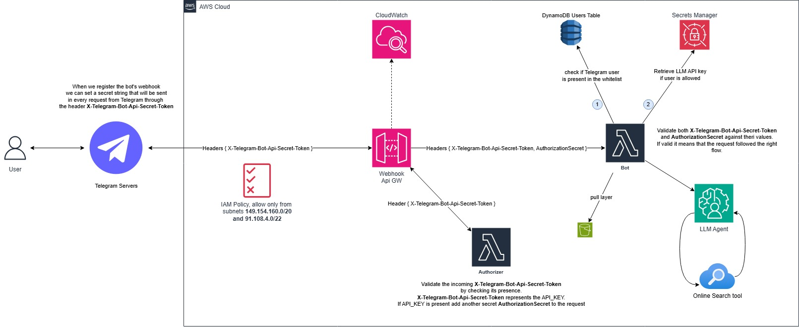

# Overview

- Want to create you own LLM Telegram bot?
- Want to know how to create a fully-serverless and secure Telegram webhook bot on AWS?

This project shows how to deploy and register a Telegram bot backed
by serverless AWS architecture. It exposes a secure API that act as a wrapper
for an LLM of choice.

## Architecture

## Set Up Infrastructure and Telegram Bot

1. Create a telegram bot and obtain a **bot token** --> [CREATE_BOT.md](docs/CREATE_BOT.md)
2. Set up the infrastructure by running the Terraform script --> [SET_UP_INFRA.md](docs/SET_UP_INFRA.md)

## 📝 License

MIT License – see the [LICENSE](LICENSE) file for details.